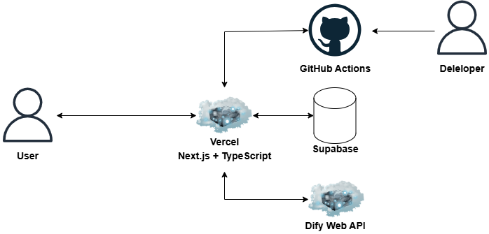

# チャットAIを使ったWebアプリケーション

## Summary

Difyを使ってチャットAIを実装したWebアプリケーションです。
2Dモードと3Dモードがあります。3Dモードでは、ReadyPlayerMeのアバターを使用しています。

# Tech

[](https://nextjs.org/)
[](https://www.typescriptlang.org/)
[](https://tailwindcss.com/)
[](https://threejs.org/)
[](https://readyplayer.me/)
[](https://mixamo.com/)
[](https://dify.ai/)
[](https://supabase.com/)
[](https://react-hook-form.com/)
[](https://prettier.io/)
[](https://playwright.dev/)
[](https://jestjs.io/)

## Architecture



## 開発環境のセットアップ

-   リポジトリのクローン

```bash
git clone https://github.com/yourusername/nextjs-echo-text-speech-app.git
```

-   依存関係のインストール

```bash
cd frontend
npm install
```

-   環境変数の設定

```bash
cp .env.example .env
```

-   開発サーバーの起動

```bash
npm run dev
```

### 環境変数

```
.env.exampleを参照してください
```

## テスト

-   ユニットテスト

```bash
npm run test
```

-   E2Eテスト

```bash
npm run test:e2e
```

-   テストカバレッジの確認

```bash
npm run test:coverage
```

## デプロイメント

-   プロダクションビルド

```bash
npm run build
```

-   ビルドの確認

```bash
npm run start
```

### コーディング規約

-   ESLintとPrettierの設定に従ってください
-   コンポーネントにはJSDocコメントを付けてください
